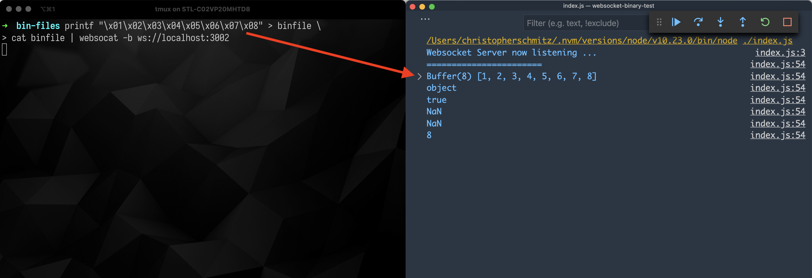
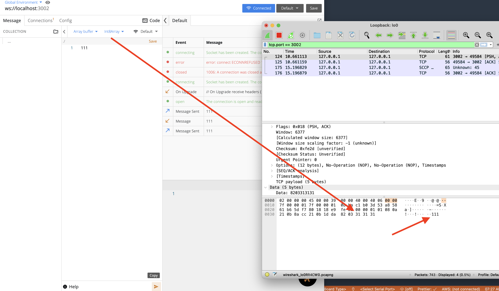

# Websocket binary test

## The problem

I've been running into issues transmitting binary information via websockets. Every time I sent a number up to my websocket server from a test client that should have been in binary form I would receive a buffer of binary, but it would be the UTF encoding of the number character, not the number itself.

i.e. if I send up the number 101, I would get a buffer with the values [0x31, 0x30, 0x31]:


I used [wireshark](https://www.wireshark.org/) to inspect the data frames from the client before they hit the server and saw this snag, so it's not something on the server side, it's something happening at the client level.

Also, I fully expected that this issue was an issue of me not understanding how to use the tools to do what I wanted to do, not an issue of the tools themselves.

After talking a bit with the maintainers of [Firecamp](http://firecamp.io/), my fav socket testing tool, one asked if I had a repository that they could test out on, so I created this one.

## A solution from the CLI

Incidentally, while I was troubleshooting I also ran into the same issues in another socket testing tool I use called [websocat](https://github.com/vi/websocat). While troubleshooting [I asked about this snag on stackoverflow about](https://stackoverflow.com/questions/65449143/sending-data-as-binary-via-websockets-encodes-numbers-as-text/65453539#65453539) (this has probably the most documented detail of the issue aside from this repository) and also figured out the solution (which I added as an answer): the methods I was using to send the data via the CLI were all producing strings, not numbers.

I don't want to go into detail here (check the stackoverflow post for that), but the tl;dr is that from the cli with websocat I needed to send in the message content in a way that produced binary, like using `printf`:

```
printf "\x01\x02\x03\x04\x05\x06\x07\x08" | websocat -b ws://localhost:3002
```

When you strike the `x` for a number in printf it's interpreted as hexadecimal format instead of a string, so piping that into the websocat call and using the `-b` flag results in a single message being relayed up to the websocket server that is sent as a binary buffer with values that reflect the actual numbers passed in:


_Note that here I'm using a intermediate file to store the binary, but I realized after that I could just pipe the output directly from printf_.

## A solution for Firecamp

All of that said, I don't know why it's happening with Firecamp when I use the ArrayBuffer setting.



Hopefully this repository will help figure out the issue (even if that issue is just me not using the tool correctly :P ).
